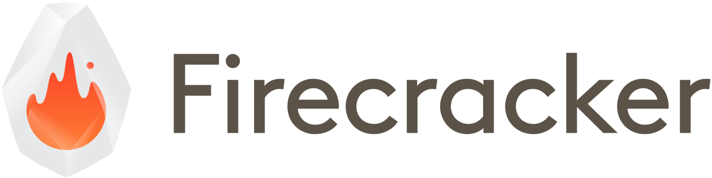

Our mission is to enable secure, multitenant, minimal-overhead execution of
container and serverless workloads.

Read more about the Firecracker Charter [here](CHARTER.md).

## What is Firecracker?

Firecracker is an open source virtualization technology that is purpose-built
for creating and managing secure, multitenant containers and functions-based
services. Firecracker enables you to deploy workloads in lightweight virtual
machines, called microVMs, which combine the security and workload isolation
properties of traditional VMs with the speed and resource efficiency of
containers (you can create microVMs with any combination of vCPUs and memory).

Firecracker implements a virtual machine monitor (VMM) that uses the Linux
Kernel Virtual Machine (KVM) to create and manage microVMs (there is one
Firecracker process per microVM). Firecracker has a minimalist design. It
excludes unnecessary devices and guest functionality to reduce the memory
footprint and attack surface area of each microVM. This improves security,
decreases the startup time, and increases hardware utilization. Firecracker
currently supports Intel CPUs, with planned AMD and ARM support. Firecracker
will also be integrated with popular container runtimes.

Firecracker was developed at Amazon Web Services to accelerate the speed and
efficiency of services like [AWS Lambda](https://aws.amazon.com/lambda/) and
[AWS Fargate](https://aws.amazon.com/fargate/). Firecracker is open
sourced under [Apache version 2.0](LICENSE).

To read more about the benefits of Firecracker, check out
[firecracker-microvm.io](https://firecracker-microvm.github.io).

## Getting Started

To try out Firecracker, go to the [quickstart guide](docs/getting-started.md).

To enable service owners to run microVM-based containers in multitenant
production fleets, we are working to integrate Firecracker in the container
ecosystem; once this integration is complete, customers will be able to run
pods, tasks, and containers within Firecracker microVMs.

Service owners will also need to ensure that their host OS is configured to a
security bar that enables safe multitenant computing. A configuration that we
consider meets this bar is included in
[the production host setup document](docs/prod-host-setup.md).

## Contributing

Firecracker is already running production workloads within AWS, but it's still
day 1 on the journey guided by our [mission](CHARTER.md). There's a lot more to
build and we welcome all contributions.

To contribute to Firecracker, check out the development setup section in the
[getting started guide](docs/getting-started.md) and then the Firecracker
[contribution guidelines](CONTRIBUTE.md).

## Releases

New Firecracker versions are released via the GitHub repository
[releases](https://github.com/firecracker-microvm/firecracker/releases) page,
typically every one or two months. A history of changes is recorded in our
[changelog](CHANGELOG.md).

## Design

Firecracker's overall architecture is described in
[the design document](docs/design.md).

## Features & Capabilities

Firecracker consists of a single micro Virtual Machine Manager process that
exposes an API endpoint to the host once started. The API is
[specified in OpenAPI format](api_server/swagger/firecracker.yaml).

The **API endpoint** can be used to:

- Configure the microvm by:
  - Setting the number of vCPUs (the default is 1).
  - Setting the memory size (the default is 128 MiB).
  - Choosing a CPU template (currently, C3 and T2 are available).
- Add one or more network interfaces to the microVM.
- Add one or more read-write or read-only disks to the microVM, each represented
  by a file-backed block device.
- Trigger block device rescan while the guest is running. This enables the
  guest OS to pick up size changes to the block device's backing file.
- Change the backing file for a block device, before or after the guest boots.
- Configure rate limiters for virtio devices which can limit the bandwidth,
  operations per second, or both.
- Configure the logging and metric system.
- `[BETA]` Configure the data tree of the guest-facing metadata service. The
  service is only available to the guest if this resource is configured.
- `[EXPERIMENTAL]` Add one or more [vsock sockets](docs/experimental-vsock.md)
  to the microVM.
- Start the microVM using a given kernel image, root file system, and boot
  arguments.
- Stop the microVM.

**Built-in Capabilities**:

- Demand fault paging and CPU oversubscription enabled by default.
- [Jailer](docs/jailer.md) process for starting Firecracker in production
  scenarios; applies a cgroup/namespace/seccomp rule isolation barrier and then
  drops privileges. 

## Performance

Firecracker's performance characteristics are listed as part of the
[specification documentation](SPECIFICATION.md). All specifications are a part
of our commitment to enabling container and serverless workloads, and are
therefore enforced via continuous integration testing.

## Policy for Security Disclosures

The security of Firecracker guests is our top priority. If you suspect you have
uncovered a vulnerability, get in touch with us; we will immediately prioritize
your disclosure. More details on our process for dealing with this type of event
can be found in [our security policy document](SECURITY-POLICY.md).

## Contact & Additional Questions

You can contact us via GitHub Issues in this repository, or via our
[Slack workspace](https://firecracker-microvm.slack.com). Issues and Slack chat
are also the place to ask questions beyond those already answered in the
[Firecracker FAQ](FAQ.md).
