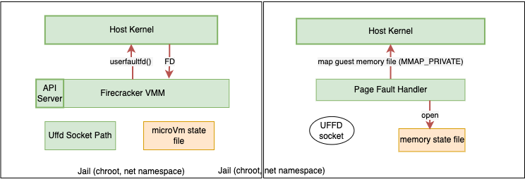
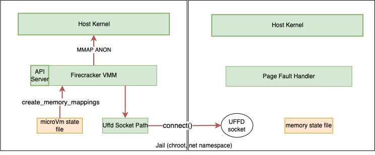
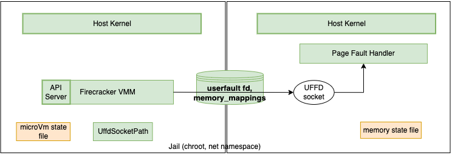

# Handling snapshot memory loading

Firecracker allows for a better management of the microVM's memory loading by
letting users choose between relying on host OS to handle the page faults when
resuming from a snapshot, or having a dedicated userspace process for dealing
with page faults, with the help of
[Userfaultfd](https://www.kernel.org/doc/html/v4.18/admin-guide/mm/userfaultfd.html).

## Kernel

When resuming a microVM from a snapshot, loading the snapshotted guest's memory
(which is file-backed) into RAM is usually kernel's responsibility and is
handled on a per-page-fault basis. Each time the guest touches a page that is
not already in Firecracker's process memory, a page fault occurs, which triggers
a context switch and IO operation in order to bring that page into RAM.
Depending on the use case, doing this for every page can be time-consuming.

## Userfaultfd

Userfaultfd is a mechanism that passes that responsibility of handling page
fault events from kernel space to user space. In order to be able to interact
with this mechanism, userspace needs to firstly obtain an userfault file
descriptor object (UFFD).

### Creating a UFFD object

#### Kernel 5.10

For host kernel 5.10 UFFD objects are created by calling into
[`userfaultfd` syscall](https://man7.org/linux/man-pages/man2/userfaultfd.2.html).

#### Kernel 6.1

For kernel 6.1, UFFD is created through the `/dev/userfaultfd` device. Access to
`/dev/userfaultfd` is managed by file system permissions, so the Firecracker
process needs to have proper permissions to create the UFFD object. When
`/dev/userfaultfd` is present on the host system, jailer makes it available
inside the jail and Firecracker process can use it without any further
configuration.

If a user is not using Firecracker along with the jailer, they should manage
manually permissions to `/dev/userfaultfd`. For example, on systems that rely on
access control lists (ACLs), this can be achieved by:

```bash
sudo setfacl -m u:${USER}:rw /dev/userfaultfd
```

### Registering memory to be handled via Userfault File Descriptors

Next, the memory address range must be registered with the userfault file
descriptor so that the userfault object can monitor page faults occurring for
those addresses. After this, the user space process can start reading and
serving events via the userfault file descriptor. These events will contain the
address that triggered the fault. The fault-handling thread can choose to handle
these events using these
[operations](https://www.kernel.org/doc/html/latest/admin-guide/mm/userfaultfd.html#resolving-userfaults).

In the flow described above, there are two userspace processes that interact
with each other in order to handle page faults: Firecracker process and the page
fault handler. Please note that users are responsible for writing the page fault
handler process to monitor userfaultfd events and handle those events.

Below is the interaction flow between Firecracker and the page fault handler
(designed by the users):

- Page fault handler binds and listens on a unix domain socket in order to be
  able to communicate with the Firecracker process.


Please note that when using the Jailer, the page fault handler process, UDS and
memory file must reside inside the jail. The UDS must only be accessible to
Firecracker and the page fault handler.

- PUT snapshot/load API call is issued towards Firecracker's API thread. The
  request encapsulates in its body the path to the unix domain socket that page
  fault handler listens to in order to communicate with Firecracker.
- Firecracker process creates the userfault object and obtains the userfault
  file descriptor.
- The page fault handler privately mmaps the contents of the guest memory file.



- Firecracker anonymously mmaps memory based on the memory description found in
  the microVM state file and registers the memory regions with the userfault
  object in order for the userfaultfd to be aware of page fault events on these
  addresses. Firecracker then connects to the socket previously opened by the
  page fault process.



- Firecracker passes the userfault file descriptor and the guest memory layout
  (e.g. dimensions of each memory region, and their [page size](../hugepages.md)
  in KiB) to the page fault handler process through the socket.



- After sending the necessary information to the page fault handler, Firecracker
  continues with the normal cycle to restore from snapshot. It reads from the
  microVM state file the relevant serialized components and loads them into
  memory.

- Page faults that occur while Firecracker is touching guest memory are handled
  by the page fault handler process, which listens for events on the userfault
  file descriptor that Firecracker previously sent. When a page fault event
  happens, the page fault handler issues `UFFDIO_COPY` to load the previously
  mmaped file contents into the correspondent memory region.

After Firecracker sends the payload (i.e. mem mappings and file descriptor), no
other communication happens on the UDS socket (or otherwise) between Firecracker
and the page fault handler process.

### Userfaultfd interaction with balloon

The balloon device allows the host to reclaim memory from a microVM. For more
details on balloon, please refer to [this doc](../ballooning.md).

When the balloon device asks for removal of a memory range, Firecracker calls
`madvise` with the `MADV_DONTNEED` flag in order to let the kernel know that it
can free up memory found in that specific area. On such a system call, the
userfaultfd interface sends `UFFD_EVENT_REMOVE`.

When implementing the logic for the page fault handler, users must identify
events of type `UFFD_EVENT_REMOVE` and handle them by zeroing out those pages.
This is because the memory is removed, but the area still remains monitored by
userfaultfd. After a cycle of inflation and deflation, page faults might happen
again for memory ranges that have been removed by balloon (and subsequently
zeroed out by the page fault handler). In such a case, the page fault handler
process must zero out the faulted page (instead of bringing it from file), as
recommended by
[the userfaultfd documentation](https://www.kernel.org/doc/html/latest/admin-guide/mm/userfaultfd.html#non-cooperative-userfaultfd).

In case of a compromised balloon driver, the page fault handler can get flooded
with `UFFD_EVENT_REMOVE`. We recommend using the jailer's built-in cgroup
functionality as defense in depth, in order to limit resource usage of the
Firecracker process.

### Caveats

If the handler process crashes while Firecracker is resuming the snapshot,
Firecracker will hang when a page fault occurs. This is because Firecracker is
designed to wait for the requested page to be made available. If the page fault
handler process is no longer around when this happens, Firecracker will wait
forever. Users are expected to monitor the page fault handler's status or gather
metrics of hanged Firecracker process and implement a recycle mechanism if
necessary.

It is the page fault handler process's responsibility to handle any errors that
might occur and also send signals to Firecracker process to inform it of any
crashes/exits. The page fault handler can fetch Firecracker's PID through
`getsockopt` call with `SO_PEERCRED` option, which fetches credentials of the
peer process that is connected to the socket. The returned credentials contain:
PID, GID and UID of the peer process (Firecracker in the page fault handler's
case).

We recommend that the page fault handler includes timeouts for waiting on
Firecracker to connect to the UDS or send information over the UDS, in order to
account for unexpected cases when Firecracker crashes before being able to
connect/send data.

### Example

An example of a handler process can be found
[here](../../src/firecracker/examples/uffd/valid_handler.rs). The process is
designed to tackle faults on a certain address by loading into memory the entire
region that the address belongs to, but users can choose any other behavior that
suits their use case best.
